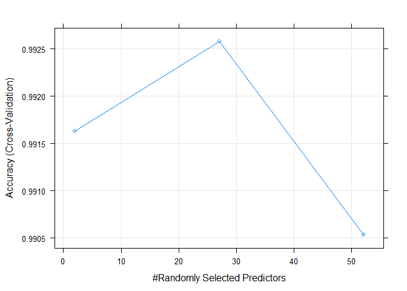
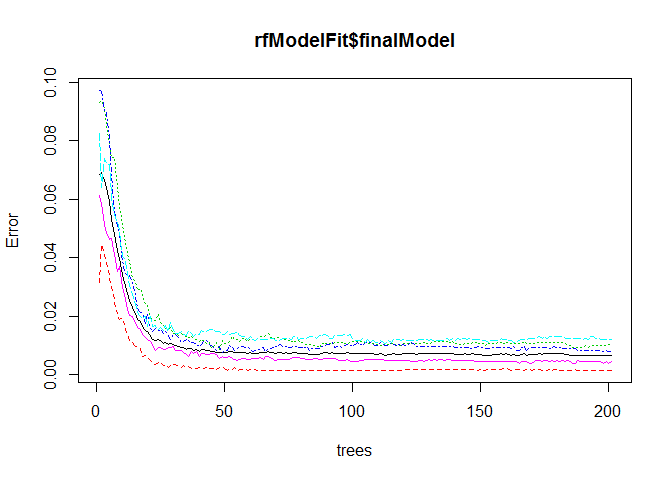

# Practical Machine Learning Course Project
GN  
October 06, 2017  


## Overview

This is the Practical Machine Learning course project for data science specialization. The report will use the devices dataset from the http://groupware.les.inf.puc-rio.br/har project. 

The goal of this analysis is to use the data from accelerometers on belt, forearm, arm, and dumbbell of 6 male participants aged between 20-28 years. They all used 1.25Kg dumbbell. The participants performed bicep curls correctly and incorrectly. This is captured in the "classe" variable and the different factors are listed below

* Class A -- According to the specification
* Class B -- Throwing the elbows to the front
* Class C -- Lifting the dumbbell only halfway
* Class D -- Lowering the dumbbell only halfway
* Class E -- Throwing the hips to the front

The goal of this project is to predict the manner in which they did the exercise.

## Load the Data

Let's load the training dataset and look at the dimensions of the data sets


```r
library(caret)
```

```
## Loading required package: lattice
```

```
## Loading required package: ggplot2
```

```r
library(rpart)
library(rpart.plot)
library(randomForest)
```

```
## randomForest 4.6-12
```

```
## Type rfNews() to see new features/changes/bug fixes.
```

```
## 
## Attaching package: 'randomForest'
```

```
## The following object is masked from 'package:ggplot2':
## 
##     margin
```

```r
# Set Working Directory
setwd("C:/Gopal/Coursera/Practical Machine Learning/CourseProject")

# Read the training and testing DataSet
trainData <- read.csv(file="pml-training.csv", header=TRUE, sep=",")
testData <- read.csv(file="pml-testing.csv", header=TRUE, sep=",")

dim(trainData)
```

```
## [1] 19622   160
```

```r
dim(testData)
```

```
## [1]  20 160
```

## Data Cleaning

The train and test data have columns that have "NAs" and empty values. These particular columns will be dropped from the analysis as they are not required. The timsetamp columns are also dropped from the data.


```r
trainData <- trainData[, colSums(is.na(trainData)) == 0] 
testData <- testData[, colSums(is.na(testData)) == 0] 

# Remove the Columns that have no impact on our analysis
trainData <- trainData[, !(grepl("X|timestamp|window", names(trainData)))]
testData <- testData[, !(grepl("X|timestamp|window", names(testData)))]
```

In the below code we get only the numeric columns for analysis. The "is.numeric" function will drop all the factor columns from the data frame and "classe" is a factor column of 5 values so it is stored in temporary values and later added to the data frame after the transformation.

```r
classeValues <- trainData$classe
trainData <- trainData[, sapply(trainData, is.numeric)]
trainData$classe <- classeValues

testData <- testData[, sapply(testData, is.numeric)]
```

# Partition the Train data set

The test data provided needs to be pristine until we have landed on a model that is very good for actual prediction. The only way to train our model is to partition the training set into 2 data sets on random split. One set will be used to train the model and other will be used to test the accuracy of the model.

```r
set.seed(1234)

# Partition the Train Data
inTrain <- createDataPartition(trainData$classe, p=0.70, list=FALSE)
trainFromTrainData <- trainData[inTrain, ]
testFromTrainData <- trainData[-inTrain, ]
```

## Model Fit
We will use a 10 fold cross validation in training the model. Random Forest model is used to fit because of its simplicity in selecting the predictors from the model for an accurate model prediction. The biggest disadvantage of the random forest is the amount of processing it requires as the number of trees goes up. I have run the model upto 1000 trees but from the plots the models predict a very similar accuracy from around 50 trees and above.


```r
# Cross Validate Control
cvControl <- trainControl(method = "cv", number = 10)

# Fit the Model
rfModelFit <- train(classe ~ ., data=trainFromTrainData, method="rf", trControl=cvControl, ntree=201)
rfModelFit
```

```
## Random Forest 
## 
## 13737 samples
##    52 predictor
##     5 classes: 'A', 'B', 'C', 'D', 'E' 
## 
## No pre-processing
## Resampling: Cross-Validated (10 fold) 
## Summary of sample sizes: 12365, 12365, 12362, 12361, 12363, 12364, ... 
## Resampling results across tuning parameters:
## 
##   mtry  Accuracy   Kappa    
##    2    0.9916306  0.9894115
##   27    0.9925749  0.9906071
##   52    0.9905360  0.9880278
## 
## Accuracy was used to select the optimal model using  the largest value.
## The final value used for the model was mtry = 27.
```

## Visualization of the Model

```r
plot(rfModelFit)
```

<!-- -->


```r
plot(rfModelFit$finalModel)
```

<!-- -->

## Predict on Training Test Data

The random forest model will be now used to predict the values in the training test data so test the model accuracy. The confusion matrix shows the values that got mapped correctly and the ones that the model wrongly classifies.


```r
rfPredictTest <- predict(rfModelFit, testFromTrainData)
confusionMatrix(testFromTrainData$classe, rfPredictTest)
```

```
## Confusion Matrix and Statistics
## 
##           Reference
## Prediction    A    B    C    D    E
##          A 1674    0    0    0    0
##          B   13 1125    1    0    0
##          C    0    4 1018    4    0
##          D    0    2    6  955    1
##          E    0    1    1    3 1077
## 
## Overall Statistics
##                                           
##                Accuracy : 0.9939          
##                  95% CI : (0.9915, 0.9957)
##     No Information Rate : 0.2867          
##     P-Value [Acc > NIR] : < 2.2e-16       
##                                           
##                   Kappa : 0.9923          
##  Mcnemar's Test P-Value : NA              
## 
## Statistics by Class:
## 
##                      Class: A Class: B Class: C Class: D Class: E
## Sensitivity            0.9923   0.9938   0.9922   0.9927   0.9991
## Specificity            1.0000   0.9971   0.9984   0.9982   0.9990
## Pos Pred Value         1.0000   0.9877   0.9922   0.9907   0.9954
## Neg Pred Value         0.9969   0.9985   0.9984   0.9986   0.9998
## Prevalence             0.2867   0.1924   0.1743   0.1635   0.1832
## Detection Rate         0.2845   0.1912   0.1730   0.1623   0.1830
## Detection Prevalence   0.2845   0.1935   0.1743   0.1638   0.1839
## Balanced Accuracy      0.9961   0.9954   0.9953   0.9954   0.9990
```

The accuracy of the model is 99.39% and the out of sample error is 0.61%. 

# Predict on downloaded test data
The model is now applied to the original testing data set downloaded to predict the classe variable.


```r
testPredictions <- predict(rfModelFit, testData)
testPredictions
```

```
##  [1] B A B A A E D B A A B C B A E E A B B B
## Levels: A B C D E
```
